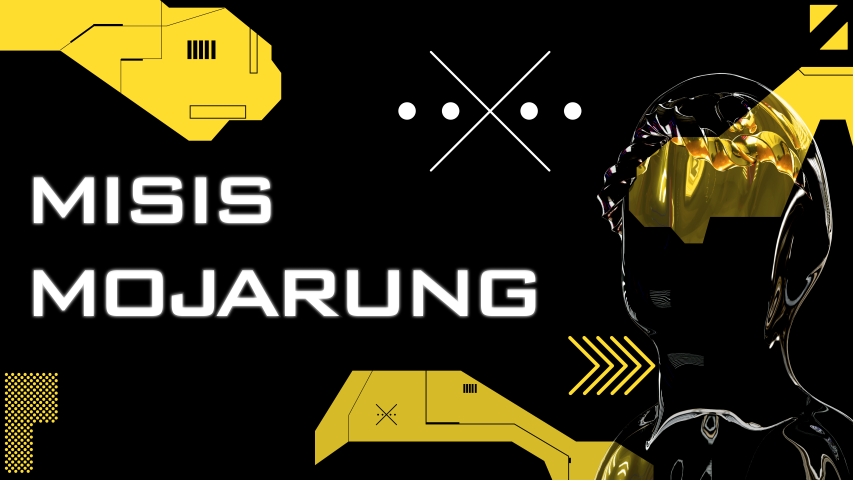

  <table border="0" cellpadding="0" cellspacing="0" width="100%">
    <tr>
      <td width="25%" valign="top" align="center" style="padding-right: 10px;">
        
      </td>
      <td width="50%" valign="middle" align="center">
        
      </td>
      <td width="25%" valign="top" align="center" style="padding-left: 10px;">
        
      </td>
    </tr>
  </table>

  
  <h2 style="font-size: 22px; font-weight: bold; margin-bottom: 10px; margin-top: 20px;">Языки и Технологии:</h2>
  
  

    
    
    
    
    
    
  

  
  

    
    
    
    
    
    
  

  
  

    
    
    
    
  

  

  <h2 style="font-size: 22px; font-weight: bold; margin-bottom: 20px;">Также в последнее время увлекаюсь дизайном презентаций, можете оценить мои работы :)</h2>

  

    

      
    

    

    

      
      
    

    

    

      
      
    

  

  

